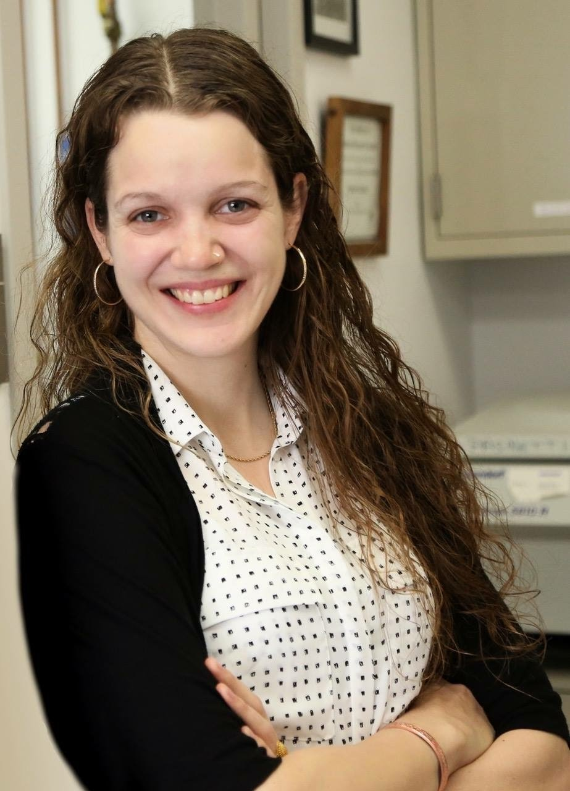

# About me: 
## Susan Westfall, Ph.D.

## How to connect
- [LinkedIn](https://www.linkedin.com/in/susan-westfall-9a7b4248){target=_blank}
- [Twitter](https://twitter.com/WestfallSusan){target=_blank}
- [Semantic Scholar](https://www.semanticscholar.org/author/Susan-Westfall/49749982){target=_blank}
- [Google Scholar](https://scholar.google.com/citations?user=EOFG8hQAAAAJ&hl=en){target=_blank}

 

## Profile Summary
I am a research scientist excited about anything and everything happening in our gut. For 15 years I've navigated through 9 departments in 3 countries exploring questions ranging from nutraceutical metabolomics to gut-brain-axis communication to host-parasite interactions. My scientific roadtrip, although winding, is rooted in fundamental questions on how the environment communicates with our body. This awe-inspiring task motivates my career choice in science to contribute a piece to the evolving understanding of what makes the human body thrive despite constant environmental challenges. In my opinion, the foundation of our body’s tolerance to the environment resides in how the gut microbiota interacts with our intestinal immune system. 

## Research Interests
 - Host-Microbiota Interactions
 - Intestinal Mucosal Immunology
 - Gut-Brain-Axis

## Education
**Post Doctoral Fellowship**: _Montreal QC_ Canada	| **2020-present** 
  - Research Institute of McGill University Health Complex (RI-MUHC)
  - Department of Microbiology and Immunology | Dr. Irah King’s Lab 			
  - Helminth infection drives IFN𝛾 production from a tissue resident CD8 T cell population to promote disease tolerance and tissue repair

**Post Doctoral Fellowship**: _New York NY_ USA	| **2018-2020** 
  - Icahn School of Medicine at Mount Sinai 
  - Department of Neurology | Dr. Giulio Pasinetti Lab 			
  - Probiotics and prebiotics prevent depression- and anxiety-like behaviors by altering peripheral Treg and Th17 immune cell populations in an AHR-dependent manner

**Ph.D. Graduate Studies**: _Montreal QC_ Canada	| **2015-2018** 
  - McGill University
  - Department of Biomedical Engineering | Dr. Satya Prakash 			
  - Development of a Novel Probiotic and Synbiotic Formulation for the Management of Neurodegenerative and Other Diseases 

**MS.C. Graduate Studies**: _Montreal QC_ Canada	| **2009-2012** 
  - McGill University
  - Department of Neuroscience | Dr. Nicolas Cermakian 			
  - The Time-Mediated Effects of Turpentine on Fever, Cytokine Induction and Peripheral Clock Gene Expression

**BS.C. Honours**: _Montreal QC_ Canada	| **2005-2009** 
  - McGill University
  - Department of Biochemistry | Dr. Thomas Duchaine 			
  - Characterization of the Helicase Domain within RNAi Machinery

## Work & Research Experience Summary
**Teaching Assistant**: _Montreal QC_ Canada	| **2016**
   - Department of Biomedical Engineering	| McGill University
   - Course: BMED505: Artificial Cells

**Research Assistant**: _Varanasi_ India	| **2013 – 2014**   
   - Department of Biochemistry	| Banaras Hindu University
   - Exploring immunological and behavioral benefits of nutraceuticals for Parkinson’s disease. 

**Research Assistant**: _Montreal QC_ Canada | **2012-2013**
   - McGill University & Genome Quebec Innovation Centre
   - Determination of epigenetic modifications in clinical sampes using high-throughput, Next-Generation sequencing technologies for MethylC-Seq, ChIP-Seq and RNA-Seq

**Teaching Assistant and Grader**: _Montreal QC_ Canada | **2011-2012**
   - Department of Biochemistry | McGill University
   - Bioc300D2: Laboratory in Biochemistry                                                                                      	
     
**Undergraduate Researcher** _Montreal QC_ Canada  | **2007**
   - Department of Biomedical Engineering | McGill University
   - iGEM: International Genetically Engineered Machines Competition | MIT
   - Group research leader for iGEM. We strove to engineer a robust quorum sensor in bacteria and to mathematically model this stochastic system for execution in Mathematica. 

## Fellowships
 - CIHR Postdoctoral Fellowship | $45,000 annually | Section Rank: top 2.7%  | **2021-2025**
 - American Association of Immunology (AAI) Salary Fellowship | $75,000 (Awarded) | **2021**
 - McLaughlin Postdoctoral Fellowship, Dept. Medicine, McGill | $25,000 | **2021**
 - Excellence Award, Dept. Biomedical Engineering, McGill University | $5000 annually | **2017-2018**
 - Max Binz Award, Dept. of Medicine, McGill University | $12,000 annually | **2017-2018**
 - NSERC CGS Ph.D. Fellowship | $35,000 annually | **2014-2017**
 - FRSQ Master’s Fellowship | $17,500 annually | 2009-2012
 - Summer NSERC Undergraduate Research Studentship Award | $5625 | **2008**
 - J.W. McConnell Scholarship, McGill (internal) | $3000 annually | 2005-2009

## Honours & Awards
 - Travel Award Society for Mucosal Immunology (SMI), ICMI. Seattle, USA | $1000USD | **2022**
 - 1st Poster Prize, Woods Hole Immunoparasitology Meeting, WHIP. Mass. USA | $500USD | **2021**
 - Journal Top 100 Reads (Rank 26) in Scientific Reports (Longevity Extension in Drosophila) | **2019**
 - 1st Poster Prize at Probiota international conference. Amsterdam, NL. | **2016**
 - Invited Talk for Seminar Series in Dept. Immunology, McGill University | **2015**
 - 1st Oral Prize at Natural Health and Product Research International Conference | $250	| **2015**
 - Shastri Indo-Canadian Institute Travel Grant, international competition | $1000 | **2014**
 - 1st Poster Prize, International Congress on Holistic Medicine Conference, Kerala, India | **2013**
 - Graduate Program of Neuroscience Entrance Scholarship | $10,000 | **2009**                                                            
 - Further 1st Place Awards International & Domestic: 13 awarded | **2007-2011**

## Other Activities
**Teaching Experience**
   - Intermediate Immunology, MIMM314, Guest Lecturer | **Feb 2023**
   - Mentor, INDS123, Research Fundamentals for Medical Students | **2022-2023**
   - Honors Immunology, MIMM501/502, Guest Lecturer | **2021-2022**

**Editorial Experience**
   - Member of CIHR Review Committee for Doctoral Students | **2023**
   - Co-editor Frontiers in Immunology Special Research Topic | **2022-present**
   - Co-editor to Frontiers in Immunology Editorial Board | **2022-present**

**Student Supervision**
   - Undergraduates (6): L. Saraffin, S. Cleff, F. Grafton, S. Sorrini, C. Shum-Tim & M. Syssoeva
   - MSc & PhD candidates (3): Umar Iqbal, Leila Faradel, Gabriel Barragan
   - Research Associates (1): Francesca Caracci

**Invited Judge**
   - Conference Poster judge at Annual Montreal Parasitology Symposium | **2022**
   - RI-MIHC Graduate Research Day judge of poster/oral presentations | **2022**

**Industrial Experience**
   - Vice President Proviva Pharma Inc.: Montreal QC, Canada. (part-time) | **2015-2019**
   - spin-off created with my PhD supervisor to sell probiotic and prebiotic formulations internationally

 
