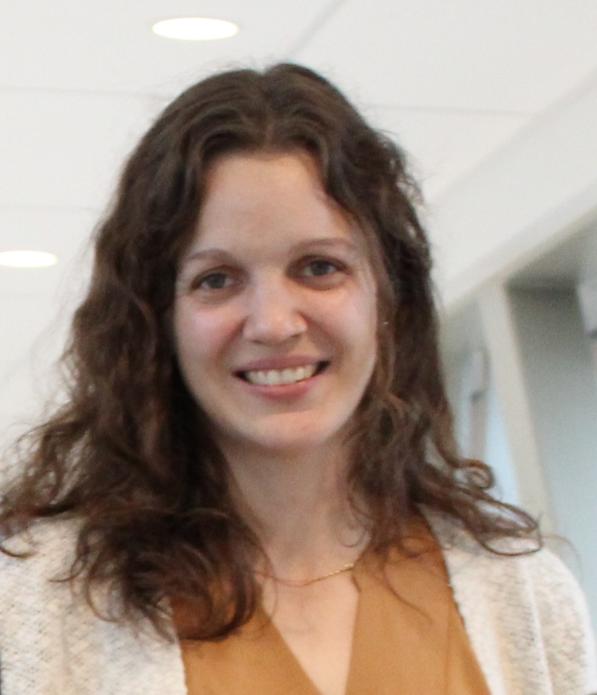

# About me
## Susan Westfall, Ph.D.

## How to connect
- [Linkedin](https://www.linkedin.com/in/susan-westfall-9a7b4248){target=_blank}
- [BlueSky](https://bsky.app/profile/susanwestfall.bsky.social){target=_blank}
- [Pubmed](https://www.ncbi.nlm.nih.gov/myncbi/susan.westfall.1/bibliography/public/){target=_blank}
- [Google Scholar](https://scholar.google.com/citations?user=EOFG8hQAAAAJ&hl=en){target=_blank}

 

## Profile Summary
I am a mucosal immunologist fascinated by host-environmental interactions. Intestinal architecture provides a unique landscape to understand how multiple tissue compartments, both host and bacterial, must coordinate their response to damage and invasion to establish homeostasis and promote health. Dysbiosis, damage and disease disrupt this delicate balance resulting in inflammatory bowel diseases (IBD), cancer and small intestinal dysmotility. My current research shows that our body’s environmental tolerance resides in multi-compartmental communication between the immune system, stromal backbone and the gut microbiota. I study tissue microenvironments with both functional and unbiased approaches in order to unravel targetable pathways that can inform therapeutic development.

I look forward to establishing an independent research platform that will detangle multi-compartmental communication in intestinal tissue microenvironments to facilitate development of targeted therapies against gastrointestinal disorders.

## Research Interests
- Mucosal Immunology
- Gut Microbiota
- Host-Parasite Interactions
- Gut-Brain-Axis

